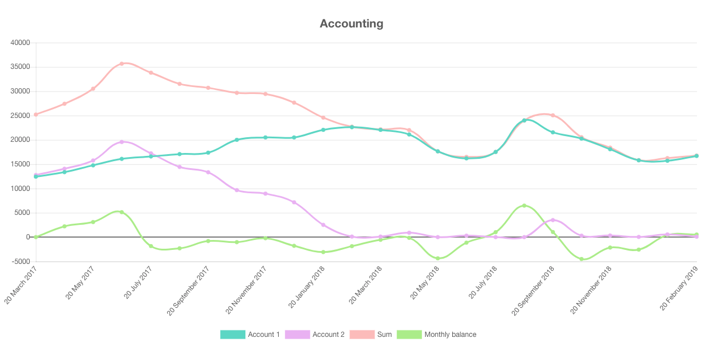

Transform Google sheets to pretty charts using this React Component!

Check out the [Live Demo!](https://robochart.netlify.com/) or the [Live Demo GitHub Repository](https://github.com/postlight/robo-chart-web)

## How to Install

1. The package can be installed via NPM:

    > npm install @postlight/react-google-sheet-chart --save

2. Generate a Google API Key: https://console.cloud.google.com/apis/credentials
3. Create `REACT_APP_CHART_TOKEN` field in your `.env` file containing the generated API Key
4. Create `REACT_APP_GSHEETS_API` field in your `.env` file containing the Google Sheets API URL: `https://sheets.googleapis.com/v4/spreadsheets/`

## How to use

Import RoboChart react component then initialize it with at least two props:

-   `id`: contains the Spreadsheet ID, e.g. `1RE_JYUCXBXY2LNV5Tp5GegLnMue-CpfTVMxjdudZ8Js` (extractable from a Google sheet URL)
-   `sheet`: containing the sheet name to read from

You can try it out by:

1. [Creating a react app](https://github.com/facebook/create-react-app)
2. Installing the package by following `How to Install` section
3. Pasting the following in `App.js`:

```
    import React, { Component } from 'react';
    import RoboChart from '@postlight/react-google-sheet-chart';
    import './App.css';

    const style = { width: '1200px', margin: '0 auto' };
    class App extends Component {
        render() {
            return (
                <div style={style}>
                    <RoboChart
                        id="1RE_JYUCXBXY2LNV5Tp5GegLnMue-CpfTVMxjdudZ8Js"
                        sheet="Accounting"
                    />
                </div>
            );
        }
    }
    export default App;
```

Other possible props:

-   `start` e.g. "A5"
-   `end` e.g. "E15"
-   `title` e.g. "My Accounts"
-   `flipAxis` e.g {false}
-   `startFrom` e.g. {0}
-   `stacked` e.g. {false}
-   `type` one of: "line", "bar", "horizontalBar", "stacked", "pie", "semi-pie", "doughnut", "semi-doughnut"
-   `colors` e.g. {['#a1a1a1', '#434343', '#ff0055']}

Another Example:

```
    <RoboChart
        id="1RE_JYUCXBXY2LNV5Tp5GegLnMue-CpfTVMxjdudZ8Js"
        sheet="Companies Values"
        type="semi-pie"
        title="Companies values in Billion $"
        colors={['#a1a1a1', '#995500', '#990055', '#009955']}
    />
```

## Spreadsheet format

In order to successfuly generate a chart, the Spreadsheet should have Row titles, Column titles and Values, example:


## License

Licensed under either of the below, at your preference:

-   Apache License, Version 2.0
    ([LICENSE-APACHE](LICENSE-APACHE) or http://www.apache.org/licenses/LICENSE-2.0)
-   MIT license
    ([LICENSE-MIT](LICENSE-MIT) or http://opensource.org/licenses/MIT)

## Contributing

Unless it is explicitly stated otherwise, any contribution intentionally submitted for inclusion in the work, as defined in the Apache-2.0 license, shall be dual licensed as above without any additional terms or conditions.

---

🔬 A Labs project from your friends at [Postlight](https://postlight.com/labs)
